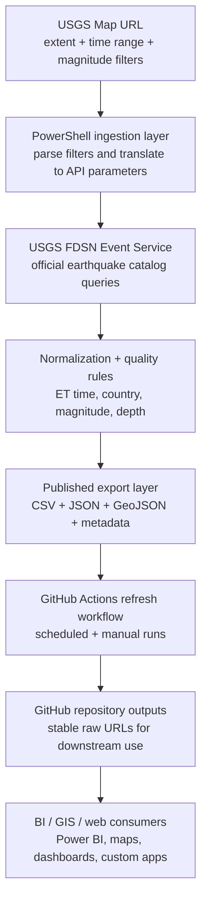

# 🌎 USGS Seismic Dashboard
### Near-Live Earthquake Data Pipeline + Dashboard-Ready Feed

Cloud-automated seismic data pipeline for USGS earthquake activity across a configurable map extent.

**Build:** GitHub Actions automated  
**Data source:** USGS Earthquake Catalog  
**Delivery:** Curated CSV, JSON, GeoJSON, and metadata exports  
**Audience:** BI, GIS, research, newsroom, and web application consumers

## 📌 Overview

This project implements a cloud-automated seismic data pipeline that continuously ingests public earthquake data from official USGS sources, applies cleanup and presentation guardrails, and publishes analysis-ready outputs for downstream analytics and web delivery.

The repository is designed to act as the data backbone for a near-live seismic dashboard, while also serving teams that simply need clean exports they can trust.

The pipeline currently combines:

- 🌐 map-scoped filtering driven by a real USGS earthquake map URL
- 📡 official USGS FDSN event queries for structured earthquake retrieval
- 🧭 coordinate-based country enrichment using Natural Earth country boundaries
- 🧹 data-quality cleanup for timestamps, magnitude, depth, and geographic labeling
- 📦 curated CSV, JSON, GeoJSON, and freshness metadata exports
- 🤖 GitHub Actions automation for refresh, monitoring, and repository publishing

All ingestion, transformation, export, and monitoring steps run in GitHub Actions. No local machine is required for production refreshes.

## 🎯 Why This Project Exists

USGS provides excellent public earthquake data, but operational teams often still need to bridge a gap between raw event feeds and dashboard-friendly delivery.

This repository closes that gap by turning a live USGS map configuration into a repeatable, cloud-hosted publishing pipeline:

- a human can define scope visually in the USGS map
- the pipeline translates that scope into API-ready parameters
- the data is cleaned and normalized for public-facing use
- refreshed exports are committed back to the repository automatically

That makes the project useful as both an analysis feed and a foundation for a future live dashboard.

## 🏗 Architecture

### High-Level Flow



### Delivery Pattern

GitHub Actions runs the refresh pipeline on a schedule, regenerates the export layer, and pushes the latest derived files back into the repository. That means consumers can point to stable GitHub raw URLs instead of depending on a local machine or a manually refreshed spreadsheet.

## 🔄 What the Pipeline Does

- reads a USGS map URL and converts visible filters into USGS catalog API parameters
- paginates large result sets and splits oversized query windows when needed
- normalizes timestamps into `time_utc` and `time_et`
- enriches each event with a `country` label based on latitude, longitude, and place-aware fallback rules
- applies display cleanup to `magnitude` while preserving `magnitude_raw`
- applies display cleanup to `depth_km` while preserving `depth_km_raw`
- preserves operational fields such as felt reports, tsunami flag, significance, status, and event type
- exports curated CSV, JSON, GeoJSON, and pipeline metadata files
- monitors freshness and opens GitHub issues automatically if the pipeline becomes stale

## 🧹 Data Quality Guardrails

This project intentionally does more than just mirror the raw feed.

Quality adjustments include:

- 🕒 Eastern Time conversion for operational reporting
- 🌍 country enrichment from local boundary geometry instead of per-row reverse geocoding
- 🌊 offshore fallback logic so obvious near-shore events do not lose country context
- 📏 display-friendly depth rounding to one decimal place
- 📈 magnitude cleanup rules that reduce floating-point noise in presentation fields
- 🧾 preservation of raw cleaned source values through `magnitude_raw` and `depth_km_raw`
- 🚨 fallback labeling for remote oceanic events such as `International Waters`

The result is a feed that is better suited for dashboards, spreadsheets, charts, and public reporting than the raw API payload alone.

## 📂 Data Sources

### Official Seismic Source

- **USGS Earthquake Map:** [https://earthquake.usgs.gov/earthquakes/map/](https://earthquake.usgs.gov/earthquakes/map/)
- **USGS FDSN Event Service:** [https://earthquake.usgs.gov/fdsnws/event/1/](https://earthquake.usgs.gov/fdsnws/event/1/)

### Geographic Enrichment Source

- **Natural Earth Country Boundaries:** [https://raw.githubusercontent.com/nvkelso/natural-earth-vector/master/geojson/ne_110m_admin_0_countries.geojson](https://raw.githubusercontent.com/nvkelso/natural-earth-vector/master/geojson/ne_110m_admin_0_countries.geojson)

### Configurable Scope

The geographic and temporal scope is controlled by a USGS map URL. By default, this repository is configured around a one-week, all-magnitude map view, but the pipeline can be repointed to another USGS map URL without changing the ingestion logic.

## 📦 Published Outputs

These files are the primary public deliverables of the repository.

### ✅ Curated CSV

Analytics-ready flat file for BI tools, spreadsheets, SQL import, and lightweight apps:

- [https://raw.githubusercontent.com/IFC-Chalaco/usgs-seismic-dashboard/main/usgs_seismic_stream/exports/earthquakes_live_curated.csv](https://raw.githubusercontent.com/IFC-Chalaco/usgs-seismic-dashboard/main/usgs_seismic_stream/exports/earthquakes_live_curated.csv)

### 📄 Curated JSON

Structured JSON payload with metadata and the current event collection:

- [https://raw.githubusercontent.com/IFC-Chalaco/usgs-seismic-dashboard/main/usgs_seismic_stream/exports/earthquakes_live_curated.json](https://raw.githubusercontent.com/IFC-Chalaco/usgs-seismic-dashboard/main/usgs_seismic_stream/exports/earthquakes_live_curated.json)

### 🗺 GeoJSON

Geospatial-ready feed for map tools, GIS workflows, and custom spatial apps:

- [https://raw.githubusercontent.com/IFC-Chalaco/usgs-seismic-dashboard/main/usgs_seismic_stream/exports/earthquakes_live.geojson](https://raw.githubusercontent.com/IFC-Chalaco/usgs-seismic-dashboard/main/usgs_seismic_stream/exports/earthquakes_live.geojson)

### 🧾 Pipeline Metadata

Freshness and coverage metadata for operational monitoring and sync checks:

- [https://raw.githubusercontent.com/IFC-Chalaco/usgs-seismic-dashboard/main/usgs_seismic_stream/exports/pipeline_meta.json](https://raw.githubusercontent.com/IFC-Chalaco/usgs-seismic-dashboard/main/usgs_seismic_stream/exports/pipeline_meta.json)

## 🌐 Dashboard Readiness

This repository does not yet publish a front-end dashboard experience, but it already produces the exact kind of files a live dashboard would need:

- a curated tabular feed for KPI cards and tables
- a GeoJSON feed for epicenter mapping
- normalized ET timestamps for audience-facing time logic
- metadata for freshness banners and sync indicators

In other words, the data layer is already live and dashboard-ready even if the presentation layer is still to come.

## 🧠 Data Model

### Curated Feed Fields

| Column | Description |
| --- | --- |
| `id` | USGS event identifier |
| `time_utc` | Event timestamp in UTC |
| `time_et` | Event timestamp in Eastern Time |
| `updated_utc` | Last update timestamp from USGS |
| `magnitude` | Public-facing cleaned display magnitude |
| `magnitude_raw` | Preserved cleaned source magnitude before display guardrails |
| `place` | USGS place description |
| `latitude` | Epicenter latitude |
| `longitude` | Epicenter longitude |
| `country` | Country or geographic fallback label derived from coordinates and place context |
| `depth_km` | Public-facing cleaned depth in kilometers |
| `depth_km_raw` | Preserved cleaned source depth before display rounding |
| `felt_reports` | Number of felt reports, when available |
| `cdi` | Community Determined Intensity, when available |
| `mmi` | Modified Mercalli Intensity, when available |
| `alert` | USGS alert level, when available |
| `status` | Event review status |
| `tsunami` | Tsunami flag |
| `significance` | USGS significance score |
| `event_type` | Event type from USGS |
| `title` | USGS event title |
| `detail_url` | Public USGS event page |
| `detail_api` | USGS detail API endpoint |

## 🤖 Automation & Monitoring

### GitHub Actions Workflows

- `.github/workflows/usgs-earthquake-refresh.yml`
- `.github/workflows/usgs-earthquake-stale-alert.yml`

### Automated Capabilities

- scheduled ingestion and export regeneration
- manual workflow dispatch with optional map URL overrides
- repository-published outputs refreshed automatically on `main`
- internal short-interval loop inside each scheduled run to reduce latency between updates
- serialized workflow execution to avoid overlapping write conflicts
- stale pipeline monitoring based on published metadata
- automatic GitHub issue creation when freshness thresholds are exceeded
- automatic stale issue closure when the pipeline is healthy again

### Refresh Cadence

GitHub Actions does not offer a native one-minute cron schedule. To keep the project as close to live as possible within GitHub-hosted limits, the refresh workflow triggers every five minutes and then performs an internal minute-targeted refresh loop during that execution window.

That design keeps the repository fully cloud-automated while reducing latency between published export updates.

## 📁 Repository Structure

### Core Files

- `usgs-earthquake-scraper.ps1`  
  Main ingestion and normalization script.

- `usgs_seismic_stream/publish-usgs-earthquakes.ps1`  
  Production publishing wrapper that regenerates the export layer and metadata.

- `data/ne_110m_admin_0_countries.geojson`  
  Local country boundary file used for coordinate-based enrichment.

### Export Layer

- `usgs_seismic_stream/exports/earthquakes_live_curated.csv`
- `usgs_seismic_stream/exports/earthquakes_live_curated.json`
- `usgs_seismic_stream/exports/earthquakes_live.geojson`
- `usgs_seismic_stream/exports/pipeline_meta.json`

## 🔐 Security & Data Integrity

- no credentials are stored in the repository
- no personal data is ingested or published
- only derived public datasets are committed
- raw scratch outputs remain outside version control
- schema-aware cleanup is applied before publication
- the export layer is reproducible from the repository scripts and source configuration
- `SECURITY.md` documents the repository security posture and reporting guidance

## ▶️ Run Locally (Optional)

Production refreshes are handled by GitHub Actions, but local execution is available for testing or development.

Refresh the published export layer:

```powershell
powershell -NoProfile -ExecutionPolicy Bypass -File ".\usgs_seismic_stream\publish-usgs-earthquakes.ps1"
```

Run the base scraper directly to a one-off file:

```powershell
powershell -NoProfile -ExecutionPolicy Bypass -File ".\usgs-earthquake-scraper.ps1" -OutputPath ".\earthquakes.csv"
```

## 🪪 License & Source Posture

This repository publishes derived outputs built from publicly accessible government earthquake data and open geographic boundary data. It is intended for analytical, operational, educational, and dashboard delivery use cases.

## 🙌 Closing Note

The goal of this project is simple: make authoritative USGS earthquake data easier to consume, easier to monitor, and easier to publish.

It is equal parts data engineering utility, dashboard foundation, and public-data product.
